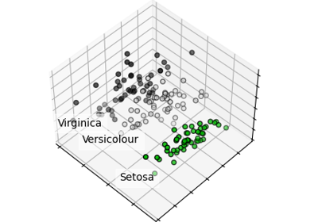

# introduction-to-machine-learning

机器学习入门

使用scikit-learn等介绍机器学习原理。

在线地址：https://tianxuzhang.github.io/introduction-to-machine-learning/README.html

内容包含以下部分

## 分类

确定对象所属的类别。

* 应用：垃圾邮件检测，图像识别。
* 算法：梯度提升、最近邻、随机森林、逻辑回归等等。

## 回归

预测与对象相关的连续值的属性。

* 应用：药物反应、股票价格。
* 算法：梯度提升、最近邻、随机森林、岭回归等等。

本章内容包含：

--------

* 线性回归
    * [一元/多元线性回归](https://tianxuzhang.github.io/introduction-to-machine-learning/docs/回归/线性回归.html)
    * [距离和范数](https://tianxuzhang.github.io/introduction-to-machine-learning/docs/回归/距离和范数.html)
    * [最小二乘法](https://tianxuzhang.github.io/introduction-to-machine-learning/docs/回归/最小二乘法.html)
    * [多项式回归](https://tianxuzhang.github.io/introduction-to-machine-learning/docs/回归/多项式回归.html)

* [正则化线性回归](https://tianxuzhang.github.io/introduction-to-machine-learning/docs/回归/正则化线性回归.html)
    * LASSO回归
    * 多任务LASSO回归
    * 岭回归
    * 弹性网络
    * 多任务弹性网络
    
* [迭代求解方法](https://tianxuzhang.github.io/introduction-to-machine-learning/docs/回归/迭代求解方法.html)
    * 最小角回归（LARS）
    * LARS LASSO
    * 正交匹配追踪法（OMP）

* [贝叶斯方法](https://tianxuzhang.github.io/introduction-to-machine-learning/docs/回归/贝叶斯方法.html)
    * 贝叶斯回归
    * 贝叶斯岭回归

* 广义线性模型
    * [逻辑回归](https://tianxuzhang.github.io/introduction-to-machine-learning/docs/回归/逻辑回归.html)
    * 多元逻辑回归
    * 泊松回归
    * GLM模型

* 其他
    * 随机梯度下降
    * 感知器
    * 被动攻击算法
    * 稳健回归

## 聚类

将相似对象自动分组到集合中。

* 应用：用户划分、实验输出分组。
* 算法：k-means、DBSCAN、层次聚类等等。

## 降维

减少要考虑的随机变量的数量。

* 应用：可视化、提高效率。
* 算法：PCA、特征选择、非负矩阵分解等等。

## 模型选择

比较、验证和选择参数以及模型。

* 应用：垃圾邮件检测，图像识别。
* 算法：网格搜索、交叉检验等等。

## 预处理

确定对象所属的类别。

* 应用：转换输入数据如文本，便于机器学习算法使用。
* 算法：预处理、特征提取等等。

